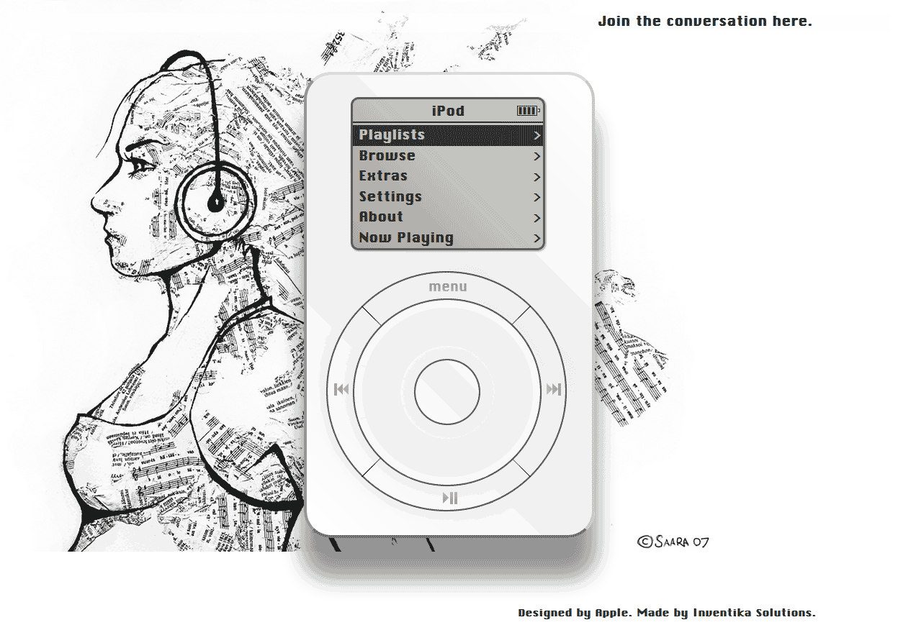

# Steve Jobs iPod Tribute

## [Open The Restored iPod](https://ibvildthings.github.io/Steve-Jobs-iPod-Tribute/)

[View this project on GitHub](https://github.com/ibvildthings/Steve-Jobs-iPod-Tribute)

In 2012, on the first anniversary of Steve Jobs' passing, I created a working first-generation iPod in HTML and CSS as a small tribute to him.

It was a browser experiment with a draggable click wheel, a monochrome-style screen, menus, playlists, extras, and songs that could actually play in the page. I put it on my old website, and then something unexpected happened: the project was picked up by Walt Mossberg, Engadget and other major tech blogs, and more than a million people visited the site that day.

Years later, the original domain and website are mostly gone. This repository brings the iPod back as a memory of that moment, restored from the Wayback Machine and repaired so the songs play again.

## How To Use It

Drag around the click wheel like you would on an original iPod. You can browse music, play and pause tracks, skip songs, adjust volume, and open little extras like Clock and Calendar.

## Press

Engadget covered the original demo in 2012:

- [Dude recreates first-gen iPod in-browser, won't put 1,000 songs in your pocket](https://www.engadget.com/2012-10-05-original-ipod-browser.html), Nicole Lee, October 5, 2012
- [Play with a classic iPod in your browser](https://www.engadget.com/2012-10-05-play-with-a-classic-ipod-in-your-browser.html), Victor Agreda Jr., October 5, 2012
